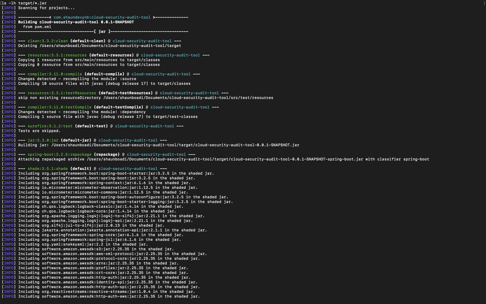
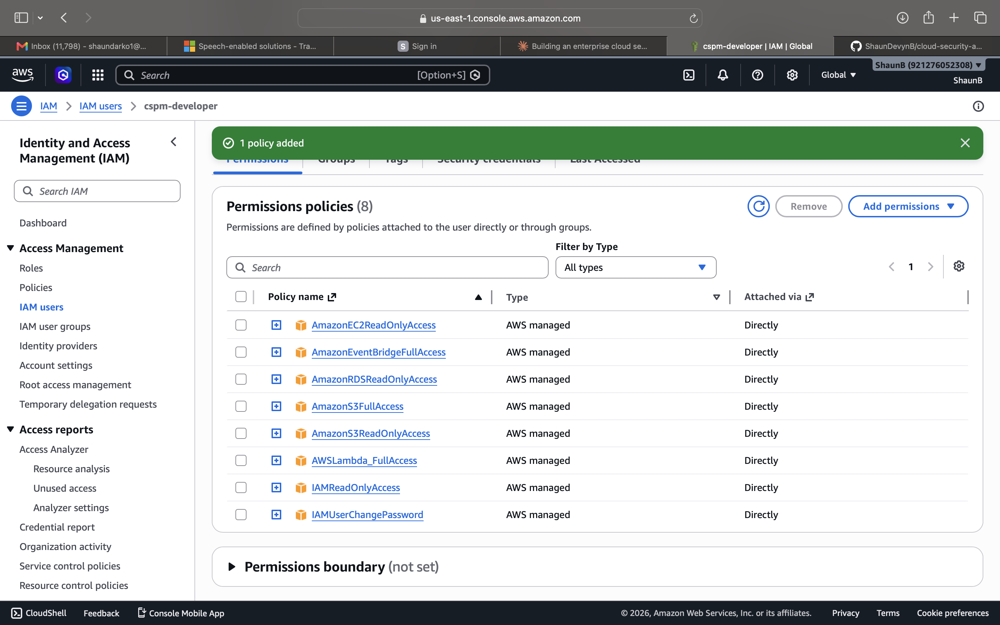
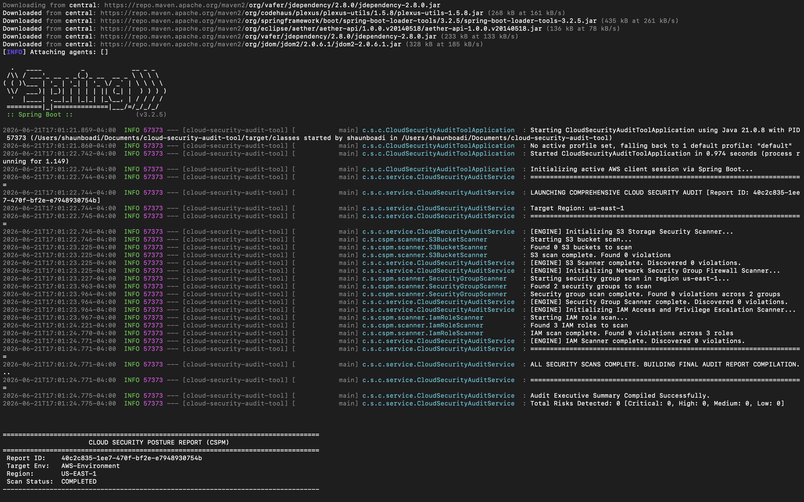

# Enterprise Cloud-Native Security Audit Tool (CSPM)

A production-grade **Cloud Security Posture Management (CSPM)** engine built with Java Spring Boot and the AWS SDK v2. Automatically scans AWS infrastructure for security misconfigurations and logs violations by severity.

---

## Live Demo — Local Scan Output


## Live Demo — AWS Lambda Execution



---

## What It Scans

| Check | Service | Severity |
|-------|---------|----------|
| Public S3 buckets (Block Public Access disabled) | S3 | CRITICAL |
| Public S3 ACLs (AllUsers / AuthenticatedUsers) | S3 | CRITICAL |
| SSH (port 22) open to 0.0.0.0/0 | EC2 Security Groups | HIGH |
| RDP (port 3389) open to internet | EC2 Security Groups | HIGH |
| Database ports exposed to internet | EC2 Security Groups | HIGH |
| AdministratorAccess policy attached to role | IAM | CRITICAL |
| Wildcard Action:* in inline policies | IAM | HIGH |
| iam:PassRole without conditions | IAM | MEDIUM |
| Unencrypted EBS volumes | EBS | MEDIUM |
| Unencrypted RDS instances | RDS | MEDIUM |
| Publicly accessible RDS instances | RDS | HIGH |

---

## Architecture
EventBridge (daily cron)

↓

AWS Lambda (Java 17, ARM64)

↓

SecurityAuditLambdaHandler

↓

CloudSecurityAuditService

↓

┌─────────────┬──────────────────┬────────────┬──────────────────────┐

│S3BucketScanner│SecurityGroupScanner│IamRoleScanner│StorageEncryptionScanner│

└─────────────┴──────────────────┴────────────┴──────────────────────┘

↓

AuditReport (JSON) → CloudWatch Logs
---

## Tech Stack

- **Language:** Java 17
- **Framework:** Spring Boot 3.2.5
- **AWS SDK:** AWS SDK for Java v2 (2.25.35)
- **Deployment:** AWS Lambda (ARM64, 512MB, 5min timeout)
- **Scheduling:** Amazon EventBridge (daily cron)
- **Logging:** CloudWatch Logs
- **Build:** Maven + Maven Shade Plugin

---

## Running Locally

**Prerequisites:** Java 17, Maven, AWS CLI configured

```bash
git clone https://github.com/ShaunDevynB/cloud-security-audit-tool.git
cd cloud-security-audit-tool
aws configure
./mvnw spring-boot:run
```

---

## Deploying to Lambda

```bash
./mvnw clean package -DskipTests
aws s3 cp target/cloud-security-audit-tool-0.0.1-SNAPSHOT.jar \
  s3://your-bucket/cloud-security-audit.jar
```

Then update the Lambda function via AWS Console or CLI.

---

## IAM Permissions Required

The Lambda execution role needs:
- `AmazonS3ReadOnlyAccess`
- `AmazonEC2ReadOnlyAccess`
- `IAMReadOnlyAccess`
- `AmazonRDSReadOnlyAccess`
- `CloudWatchLogsFullAccess`

## Posture Assessment Dashboard

When executed locally, the CSPM engine audits multi-domain infrastructure configurations (S3, EC2 Security Groups, and IAM Policies), compiling an executive summary alongside prioritized compliance violations directly to the terminal console:



---

## ☁️ AWS Lambda Orchestration & Cloud Deployment

The tool features a fully compiled AWS Lambda request handler, allowing for automated, scheduled, or event-driven infrastructure security audits in the cloud.

### Successful Lambda Execution Context


### Cloud Audit Metrics Output Log


---

## Author

**Shaun Boadi** — [github.com/ShaunDevynB](https://github.com/ShaunDevynB)
